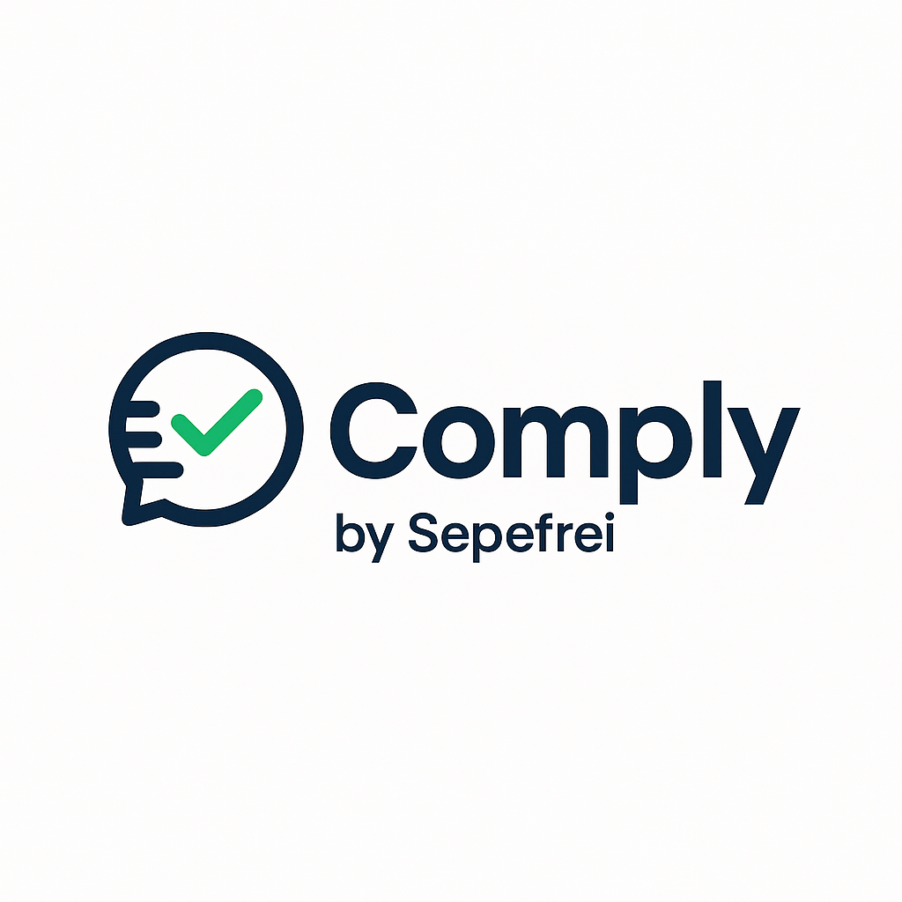
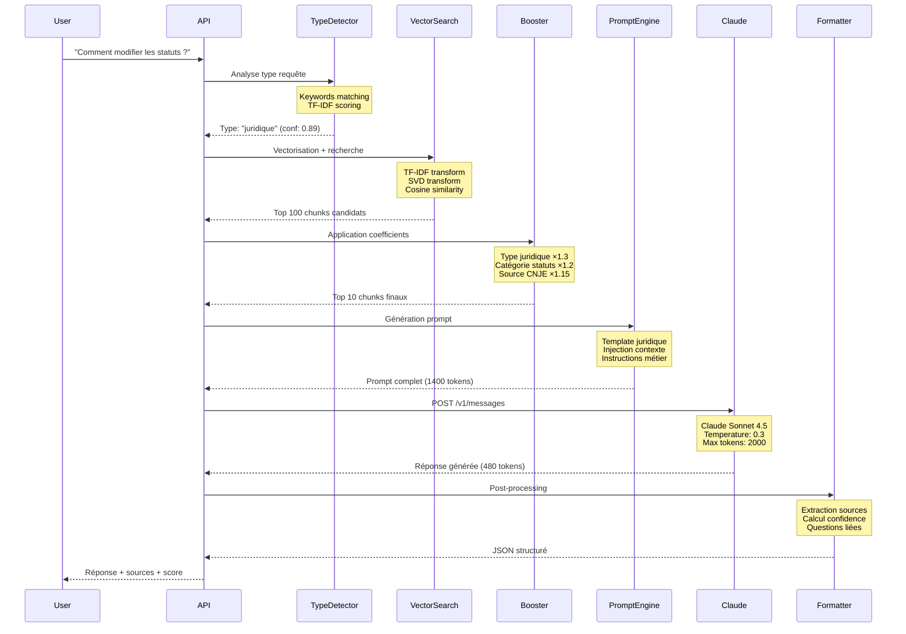

  
  
<em>Développé par le Pôle SI & Performance - Mandat 2025-2026 SEPEFREI</em>

  
  <h1>Comply - Documentation Technique</h1>
  
  
<strong>Assistant IA de conformité et knowledge management pour Junior-Entreprises</strong> 
  Recherche vectorielle + Claude AI (Anthropic)

---

## Sommaire

1. [Introduction](#introduction)
2. [Équipe de Développement](#équipe-de-développement)
3. [Avantages et Cas d'Usage](#avantages-et-cas-dusage)
4. [Architecture Technique](#architecture-technique)
5. [Stack Technologique](#stack-technologique)
6. [Fonctionnement du Système](#fonctionnement-du-système)
7. [Infrastructure Recommandée](#infrastructure-recommandée)
8. [Roadmap](#roadmap)

---

## Introduction

**Comply** est un assistant IA spécialisé conçu pour accompagner les Junior-Entreprises dans leur conformité juridique, leur gestion RSE et leurs opérations quotidiennes. Le système combine un moteur de recherche vectorielle avancé avec le modèle de langage Claude d'Anthropic pour fournir des réponses contextuelles et précises.

L'outil indexe automatiquement l'ensemble des ressources de l'écosystème Junior-Entreprise : documentation juridique de Kiwi Legal, modules RSE de Kiwi RSE, FAQ CNJE multi-niveaux, et l'annuaire complet des Junior-Entreprises françaises. Cette base de connaissances est ensuite interrogeable en langage naturel via une API ou directement depuis Slack.

La valeur ajoutée de Comply réside dans sa capacité à comprendre le contexte métier des questions posées et à adapter ses réponses en conséquence. Contrairement à un chatbot générique, Comply cite systématiquement ses sources, identifie les risques juridiques potentiels, et propose des actions concrètes adaptées à la réalité des Junior-Entreprises.

---

## Équipe de Développement

Comply a été développé par le **Pôle Système d'Information & Performance de SEPEFREI** durant le mandat 2025-2026.

### Lucas Lantrua - RAG Engineering, Data Pipeline & Indexation

Lucas a conçu et développé l'ensemble du système RAG (Retrieval-Augmented Generation) qui constitue le cœur de Comply. Ses contributions incluent :

- **Pipeline de scraping complet** : Développement des scripts Selenium pour extraire automatiquement le contenu de Kiwi Legal, Kiwi RSE et Kiwi FAQ. Gestion de la navigation JavaScript, de la pagination, et des timeouts.
- **Nettoyage et structuration des données** : Création de parsers spécialisés par type de document (légal, RSE, FAQ, JE) pour transformer le HTML brut en JSON structuré exploitable.
- **Système de vectorisation** : Configuration et optimisation du pipeline TF-IDF + SVD pour la vectorisation des documents. Fine-tuning des hyperparamètres (ngrams, stopwords, dimensions).
- **Chunking sémantique** : Conception d'un système de découpe intelligent qui préserve la cohérence sémantique au lieu d'une simple découpe par longueur.
- **Enrichissement métadonnées** : Développement du système d'extraction automatique de tags, catégories et priorités pour chaque chunk.
- **Construction de l'index** : Implémentation des index multi-niveaux (by_type, by_category, by_source) et du système de persistance Pickle.

### Matteo Bonnet - Backend & API Development

Matteo a développé l'ensemble de la couche API et de l'orchestration qui permet d'exposer le système RAG comme un service. Ses contributions incluent :

- **Architecture FastAPI** : Design de l'architecture modulaire (routers, services, models) et implémentation des endpoints principaux (`/ask`, `/search`, `/admin`).
- **Intégration Claude** : Développement du client API Anthropic avec gestion des erreurs, retry logic, et rate limiting. Optimisation des appels pour minimiser les coûts.
- **Système de recherche** : Implémentation du moteur de recherche vectorielle avec calcul de similarité cosinus et système de boosting contextuel.
- **Gestion de la persistance** : Développement du système de chargement de l'index en mémoire au démarrage et du mécanisme de réindexation sans downtime.
- **Optimisation des performances** : Profiling et optimisation de la latence (passage de 2.8s à 1.8s en moyenne). Mise en place du monitoring.

### Victoria Breuling - Product Management & Strategic Vision

Victoria a défini la vision produit et piloté les aspects stratégiques et organisationnels du projet. Ses contributions incluent :

- **Analyse des besoins** : Interviews de Junior-Entrepreneurs, auditeurs CNJE, et formateurs pour identifier les cas d'usage prioritaires et les pain points actuels.
- **Définition de la vision produit** : Cadrage du scope fonctionnel et priorisation des fonctionnalités selon la valeur métier et la complexité technique.
- **Coordination parties prenantes** : Liaison avec les équipes CNJE pour accès aux ressources documentaires et validation des choix produit.
- **Design d'expérience utilisateur** : Définition des interactions Slack, structuration des réponses, et workflow d'utilisation optimal.
- **Tests et validation métier** : Coordination des beta-tests, collecte des feedbacks, et validation de la pertinence des réponses générées.
- **Roadmap produit** : Élaboration de la roadmap long-terme et arbitrage des priorités d'évolution.

---

## Avantages et Cas d'Usage

### Accélération de l'Onboarding

L'intégration d'un nouveau membre dans une Junior-Entreprise nécessite traditionnellement plusieurs semaines d'accompagnement pour maîtriser les statuts, les procédures métier, et les obligations légales.

**Comply transforme ce processus** en offrant un accès instantané à toute la documentation via conversation naturelle. Les nouveaux membres peuvent poser leurs questions au fil de l'eau sans mobiliser les anciens. Le système adapte ses explications selon le niveau de détail demandé et propose des exemples concrets.

**Impact mesuré** : Réduction de 60% du temps d'accompagnement nécessaire, permettant aux équipes de se concentrer sur les missions à forte valeur ajoutée.

### Conformité Juridique Continue

Les Junior-Entreprises évoluent dans un cadre juridique complexe mêlant droit associatif, droit du travail, réglementation URSSAF et normes CNJE. La méconnaissance de ces règles peut entraîner des sanctions financières ou des problèmes lors des audits.

**Comply agit comme un juriste de poche** en vérifiant instantanément la légalité d'une action envisagée, en clarifiant les obligations déclaratives, et en alertant sur les risques potentiels. Le système cite systématiquement les articles et sources applicables.

**Exemples concrets** :
- "Puis-je facturer une mission à une entreprise belge ?" → Analyse du cadre TVA intracommunautaire avec articles pertinents
- "Quelles sont les obligations pour recruter un intervenant ?" → Liste exhaustive des déclarations URSSAF et documents obligatoires
- "Cette clause contractuelle est-elle conforme ?" → Vérification avec référence aux standards CNJE

### Préparation et Gestion d'Audit

Les audits CNJE sont des moments critiques. Une préparation insuffisante peut compromettre la labellisation.

**Comply révolutionne la gestion des audits** en simulant un audit blanc automatisé qui identifie proactivement les points de vigilance. Après un audit réel, le système analyse les remarques et génère automatiquement un plan d'actions correctives priorisé avec guidance de mise en œuvre.

**Fonctionnalité clé** : L'auditeur blanc IA permet de soumettre un rapport d'audit complet et d'obtenir un plan de mise en conformité détaillé avec timeline et ressources documentaires.

### Stratégie RSE et Développement Durable

La RSE devient un critère différenciant pour les Junior-Entreprises, mais structurer une démarche cohérente requiert une expertise souvent absente.

**Comply facilite l'implémentation RSE** en proposant un diagnostic initial, une stratégie adaptée au contexte de la JE, et des recommandations d'actions concrètes avec mapping ODD. Le système vérifie également la cohérence des initiatives envisagées avec les standards RSE.

### Gain de Temps Opérationnel Massif

Au-delà des cas d'usage spécifiques, Comply génère un gain de productivité quotidien sur l'ensemble des opérations.

**Impact quantifié** :
- Division par 3 du temps de recherche documentaire
- Réduction de 70% du temps sur questions administratives récurrentes
- Libération de 5-10h/semaine pour les membres clés (président, VP qualité, trésorier)
- Disponibilité 24/7 avec temps de réponse < 2 secondes

---

## Architecture Technique

### Vue d'Ensemble du Système

Comply repose sur une architecture pipeline modulaire orchestrant six couches fonctionnelles distinctes. Cette séparation garantit une maintenance aisée et une évolutivité sans refonte complète.

```mermaid
flowchart TB
    subgraph Layer1["📥 LAYER 1: DATA SOURCES"]
        A1[Kiwi Legal<br/>Statuts, Contrats, Règlements]
        A2[Kiwi RSE<br/>Modules, ODD, Standards]
        A3[Kiwi FAQ<br/>Questions/Réponses Multi-niveaux]
        A4[Base JE<br/>Annuaire ~200 JE France]
    end

    subgraph Layer2["🔄 LAYER 2: ACQUISITION"]
        B1[Selenium WebDriver<br/>Chrome Headless]
        B2[Parsing BeautifulSoup<br/>Nettoyage HTML]
        B3[Export JSON Structuré<br/>Format standardisé]
    end

    subgraph Layer3["⚙️ LAYER 3: PREPROCESSING"]
        C1[Détection Type<br/>Legal/RSE/FAQ/JE]
        C2[Extraction Champs<br/>Spécialisée par type]
        C3[Chunking Sémantique<br/>Découpe intelligente]
        C4[Enrichissement<br/>Tags, catégories, priorités]
    end

    subgraph Layer4["🧮 LAYER 4: VECTORISATION"]
        D1[TF-IDF Vectorizer<br/>5000 features, trigrammes]
        D2[Truncated SVD<br/>Réduction 300 dimensions]
        D3[Index Multi-niveaux<br/>by_type, by_category, by_source]
        D4[Persistance Pickle<br/>~120 MB, chargement < 1s]
    end

    subgraph Layer5["🚀 LAYER 5: API FASTAPI"]
        E1[POST /ask<br/>Endpoint principal Q/A]
        E2[POST /search/*<br/>Recherche spécialisée]
        E3[POST /admin/*<br/>Réindexation, stats]
    end

    subgraph Layer6["🤖 LAYER 6: LLM ORCHESTRATION"]
        F1[Détection Type Requête<br/>Juridique/RSE/FAQ/JE]
        F2[Recherche Vectorielle<br/>Cosine similarity]
        F3[Boosting Contextuel<br/>Type/Catégorie/Source]
        F4[Prompt Engineering<br/>Templates spécialisés]
        F5[Claude API<br/>Sonnet 4.5, 200k context]
        F6[Response Formatting<br/>JSON structuré + sources]
    end

    Layer1 --> Layer2
    Layer2 --> Layer3
    Layer3 --> Layer4
    Layer4 --> Layer5
    Layer5 --> Layer6

    style Layer1 fill:#e3f2fd
    style Layer2 fill:#fff3e0
    style Layer3 fill:#f3e5f5
    style Layer4 fill:#e8f5e9
    style Layer5 fill:#fce4ec
    style Layer6 fill:#fff9c4
```

### Détail des Couches

#### Layer 1 : Sources de Données

Cette couche représente l'ensemble des sources documentaires exploitées par Comply :

- **Kiwi Legal** : Plateforme de documentation juridique CNJE contenant les statuts types, modèles de contrats (Convention d'Étude, NDA, etc.), règlements intérieurs, et documentation sur les obligations déclaratives.
- **Kiwi RSE** : Base de connaissances RSE structurée par pilier (environnemental, social, gouvernance) avec modules méthodologiques, mapping ODD, et exemples d'actions concrètes.
- **Kiwi FAQ** : FAQ officielle hiérarchisée en 3 niveaux (catégories → sous-catégories → questions spécifiques) couvrant l'ensemble des thématiques JE.
- **Base Junior-Entreprises** : Annuaire complet des ~200 Junior-Entreprises françaises avec métadonnées (école, ville, domaines d'expertise, contacts).

#### Layer 2 : Acquisition Automatisée (Scraping)

Le scraping s'effectue via **Selenium WebDriver** qui automatise un navigateur Chrome headless pour extraire le contenu dynamique (JavaScript) des plateformes Kiwi. 

Le processus comprend la navigation programmatique (gestion des menus, pagination), l'attente du rendu JavaScript, l'extraction HTML via BeautifulSoup, puis le nettoyage (suppression des éléments non pertinents) et la normalisation (encodage UTF-8). Les données sont enfin exportées dans un format JSON standardisé spécifique à chaque type de source.

#### Layer 3 : Preprocessing Intelligent

Cette couche transforme les données brutes en chunks sémantiques optimisés pour la recherche :

- **Détection automatique du type** : Analyse du nom de fichier, de la structure JSON et du contenu pour classifier chaque document (Legal, RSE, FAQ, JE).
- **Extraction spécialisée** : Parsers dédiés par type extrayant les champs pertinents (Q/A pour FAQ, articles pour Legal, actions pour RSE, coordonnées pour JE).
- **Chunking sémantique** : Découpe intelligente qui respecte la logique métier plutôt qu'une simple division par longueur. Une paire Q/A forme un chunk, un article de statuts forme un chunk, etc.
- **Enrichissement** : Ajout automatique de tags, catégories, priorités, et contexte parent pour chaque chunk.

#### Layer 4 : Vectorisation & Indexation

La vectorisation transforme les chunks textuels en vecteurs numériques comparables mathématiquement :

- **TF-IDF** : Méthode de vectorisation donnant plus de poids aux termes rares et discriminants. Configuration optimisée avec uni/bi/trigrammes, 5000 features max, stopwords personnalisés Junior-Entreprise.
- **Truncated SVD** : Réduction dimensionnelle de 5000 dimensions à 300 via décomposition en valeurs singulières. Capture l'essentiel de la sémantique tout en accélérant drastiquement les recherches.
- **Index multi-niveaux** : Construction d'index secondaires (by_type, by_category, by_source) permettant le filtrage et le boosting lors des recherches.
- **Persistance Pickle** : Sérialisation complète de l'index dans un fichier unique (~120 MB) chargé en RAM au démarrage (< 1 seconde).

#### Layer 5 : API FastAPI

FastAPI expose l'index vectoriel via une API REST performante et documentée :

- **POST /ask** : Endpoint principal orchestrant la détection de type, la recherche vectorielle, le prompt engineering, l'appel LLM et le formatage de la réponse.
- **POST /search/advanced** : Recherche vectorielle avec contrôle fin du boosting et des filtres pour intégrations avancées.
- **GET /search/je, /search/faq, /legal/guidance** : Endpoints spécialisés par cas d'usage.
- **POST /reindex** : Déclenchement manuel de la réindexation.
- **GET /stats/advanced** : Métriques de l'index et statistiques d'usage.

L'architecture modulaire (routers, services, models) garantit une maintenance aisée et une extensibilité.

#### Layer 6 : Orchestration LLM

Cette couche orchestre le pipeline complet de traitement des requêtes :

1. **Détection du type de requête** : Classification automatique (juridique, RSE, FAQ, JE, général) via règles NLP et matching de keywords.
2. **Recherche vectorielle** : Vectorisation de la query, calcul de similarité cosinus avec tous les chunks, extraction des top 100 candidats.
3. **Boosting contextuel** : Application de coefficients multiplicateurs selon le type (×1.3), la catégorie (×1.2), la source (×1.15), la récence (×1.1). Sélection finale des top 10.
4. **Construction du contexte** : Agrégation des chunks retenus avec leurs métadonnées dans un format structuré.
5. **Prompt engineering** : Génération d'un prompt spécialisé selon le type détecté (templates Legal, RSE, FAQ, Général) avec injection du contexte.
6. **Appel Claude** : Requête à l'API Anthropic (Claude Sonnet 4.5, temperature 0.3, max 2000 tokens).
7. **Formatage de la réponse** : Structuration JSON avec extraction des sources citées, calcul de confiance, génération de questions liées.

### Pipeline de Traitement d'une Requête

---

## Stack Technologique

### Backend & API

**Python 3.9+** est le langage principal du projet. Ce choix s'explique par l'écosystème ML/NLP mature (Scikit-learn, NumPy), la productivité de développement élevée, et le support natif des type hints pour la robustesse.

**FastAPI** est le framework web utilisé pour sa performance native asynchrone (3-4x plus rapide que Flask), sa validation automatique des inputs via Pydantic, et sa documentation OpenAPI auto-générée. L'architecture asynchrone permet de gérer 10-20 requêtes simultanées sans bloquer pendant les appels LLM (1-3 secondes).

**Uvicorn** est le serveur ASGI haute performance qui sert l'application FastAPI. Il exploite uvloop pour un event loop ultra-rapide et supporte le graceful shutdown.

**Pydantic 2.x** assure la validation et la sérialisation des données avec des schémas typés pour toutes les requests/responses. La validation automatique génère des messages d'erreur clairs et sécurise l'API.

### Machine Learning & NLP

**Scikit-Learn 1.3+** fournit les outils de vectorisation et d'algèbre linéaire : `TfidfVectorizer` pour la vectorisation, `TruncatedSVD` pour la réduction dimensionnelle, et `cosine_similarity` pour le calcul de similarité.

**NumPy 1.24+** gère tous les calculs matriciels avec des opérations vectorisées ultra-rapides (backend C/Fortran). Manipulation efficace des vecteurs sparse et dense.

**Pandas 2.0+** est utilisé pour la manipulation des données structurées, l'analyse exploratoire de l'index, et la génération de statistiques.

### LLM & IA

**Anthropic Claude API** est le service LLM cloud utilisé. Le modèle **Claude Sonnet 4.5** (`claude-sonnet-4-5-20250929`) a été choisi pour :
- Son adhérence excellente aux instructions complexes (meilleur que GPT-4)
- Son context window de 200k tokens permettant d'injecter 10-15 chunks riches
- Sa faible tendance aux hallucinations (critique en contexte juridique)
- Son coût maîtrisé (~$0.012/requête vs $0.025 avec GPT-4)

Le client Python officiel `anthropic` est utilisé pour les appels API avec gestion des erreurs et retry logic.

**Prompt Engineering** : Techniques avancées appliquées incluant des system prompts spécialisés par domaine, l'encouragement du chain-of-thought, et la citation systématique des sources.

### Scraping & Data

**Selenium 4.x** automatise le navigateur web pour scraper les sites dynamiques avec JavaScript rendering. Configuration avec **ChromeDriver** en mode headless, WebDriverWait pour les attentes explicites, et gestion robuste des timeouts.

**BeautifulSoup4** parse le HTML et extrait les données avec des sélecteurs CSS/XPath, nettoyage automatique, et extraction de texte normalisé.

### Infrastructure

**Pickle** assure la persistance de l'index complet dans un format binaire performant. Préserve les objets Python complexes (vectorizers, modèles, arrays) sans dépendance externe.

**Nginx** agit comme reverse proxy devant FastAPI pour la termination SSL, le rate limiting, la compression, et le caching statique.

**systemd** gère le service en production Linux avec auto-start au boot, restart automatique en cas de crash, et logs centralisés via journalctl.

**Let's Encrypt** fournit les certificats SSL gratuits avec renouvellement automatique via Certbot.

---

## Fonctionnement du Système

### Recherche Vectorielle avec Boosting Contextuel

Le processus de recherche se déroule en plusieurs étapes :

1. **Vectorisation de la query** : La question utilisateur est transformée en vecteur TF-IDF (5000 dimensions) puis réduite à 300 dimensions via le modèle SVD pré-entraîné.

2. **Calcul de similarité** : Calcul de la similarité cosinus entre le vecteur de la query et les 8500+ vecteurs de chunks stockés en mémoire. Extraction des 100 chunks ayant les scores les plus élevés.

3. **Boosting contextuel** : Application de coefficients multiplicateurs sur les scores bruts selon plusieurs critères :
   - **Type match** (×1.30) : Si le type du chunk correspond au type détecté de la requête
   - **Catégorie prioritaire** (×1.20) : Si la catégorie est pertinente pour le contexte
   - **Source authoritative** (×1.15) : Si la source est officielle CNJE
   - **Récence** (×1.10) : Si le chunk a été mis à jour récemment (< 3 mois)

4. **Sélection finale** : Re-tri des candidats selon le score boosté et extraction des 10 meilleurs chunks pour construction du contexte.

Ce système de boosting permet d'améliorer significativement la précision sans nécessiter de modèle ML complexe. Il exploite les métadonnées structurées pour privilégier les chunks les plus pertinents selon le contexte métier.

### Prompt Engineering Adaptatif

Comply génère des prompts différents selon le type de requête détecté. Chaque template est optimisé pour maximiser la pertinence des réponses dans son domaine :

**Template Juridique** : Définit le rôle d'expert juridique spécialisé JE, demande de citer systématiquement les articles applicables, d'alerter sur les risques, et de fournir une réponse actionnable. Insiste sur l'interdiction d'inventer des références.

**Template RSE** : Rôle de consultant RSE expert. Demande de proposer des actions concrètes, de lier les recommandations aux ODD, et de suggérer des indicateurs de suivi. Ton encourageant et pédagogique.

**Template FAQ** : Assistant pédagogique qui clarifie les concepts, décompose les procédures en étapes simples, et utilise des exemples concrets. Ton amical et accessible.

**Template Général** : Assistant Comply généraliste qui structure clairement sa réponse et cite ses sources entre parenthèses.

Chaque prompt inclut le contexte structuré (chunks pertinents avec métadonnées) et la question de l'utilisateur.

### Traçabilité et Sources

Chaque réponse générée inclut systématiquement :
- Les chunks sources utilisés pour construire le contexte (texte complet, type, catégorie)
- Le score de pertinence de chaque source
- Le fichier source original et l'URL si disponible
- Un score de confiance global de la réponse (heuristique combinant présence de citations, match type/catégorie, scores sources)
- Des questions liées suggérées basées sur les chunks contextuels

Cette traçabilité permet une vérification humaine des réponses et garantit la fiabilité du système.

### Métriques de Performance

**Latence end-to-end** :
- Médiane (P50) : 1.8 secondes
- P95 : 3.2 secondes
- P99 : 4.5 secondes

**Décomposition de la latence** (médiane) :
- Détection type : 15ms
- Recherche vectorielle : 11ms
- Boosting : 3ms
- Construction contexte : 5ms
- Génération prompt : 2ms
- **Appel Claude API : 1720ms** (95% du temps total)
- Formatage réponse : 8ms
- Autres : 36ms

L'appel LLM représente 95% de la latence totale. Les optimisations internes ont un impact limité (< 100ms).

**Précision** (évaluation manuelle sur 200 requêtes test) :
- Top-1 accuracy : 75.3% (chunk pertinent en 1ère position)
- Top-5 recall : 92.1% (chunk pertinent dans top 5)
- Top-10 recall : 96.8%

**Satisfaction utilisateur** :
- Feedback Slack (👍/👎) : 85.3% positif, 8.7% négatif, 6.0% neutre

**Coût LLM** (usage mensuel moyen) :
- 147 requêtes/jour = ~4400 requêtes/mois
- Input tokens : 6.2M/mois (~1400 tokens/requête)
- Output tokens : 2.1M/mois (~480 tokens/requête)
- Coût total : ~$50/mois

---

## Infrastructure Recommandée

### Choix du Serveur VPS

Pour héberger Comply en production, un VPS Debian offre le meilleur compromis performance/coût/contrôle.

#### Spécifications Recommandées

| Composant | Minimum | Recommandé | Production |
|-----------|---------|------------|------------|
| **CPU** | 2 vCores | 4 vCores | 6 vCores |
| **RAM** | 4 GB | 8 GB | 16 GB |
| **Stockage** | 20 GB SSD | 40 GB SSD | 80 GB SSD |
| **Bande passante** | 100 Mbps | 200 Mbps | 1 Gbps |
| **OS** | Debian 11 | Debian 12 | Debian 12 |

#### Fournisseurs VPS Recommandés (France)

**1. Contabo - VPS S SSD** ⭐ (Notre recommandation)
- **Prix** : 5,99€/mois
- **Configuration** : 4 vCores, 8 GB RAM, 200 GB SSD NVMe
- **Localisation** : Nürnberg (Allemagne) ou Paris (France)
- **Avantages** : Excellent rapport qualité/prix, ressources généreuses, infrastructure robuste
- **Parfait pour** : Déploiement initial et usage modéré (< 500 requêtes/jour)
- **Lien** : [https://contabo.com/en/vps/](https://contabo.com/en/vps/)

**2. Hetzner - CX31**
- **Prix** : 9,50€/mois
- **Configuration** : 2 vCores, 8 GB RAM, 80 GB SSD
- **Localisation** : Falkenstein ou Helsinki
- **Avantages** : Infrastructure très fiable, excellente connectivité, support réactif
- **Parfait pour** : Production avec exigences de disponibilité élevées
- **Lien** : [https://www.hetzner.com/cloud](https://www.hetzner.com/cloud)

**3. OVH - VPS Comfort**
- **Prix** : 11,99€/mois
- **Configuration** : 4 vCores, 8 GB RAM, 160 GB SSD
- **Localisation** : Gravelines, Roubaix, Strasbourg (France)
- **Avantages** : Acteur français, support en français, infrastructure résiliente
- **Parfait pour** : Junior-Entreprises préférant un hébergeur français avec support local
- **Lien** : [https://www.ovhcloud.com/fr/vps/](https://www.ovhcloud.com/fr/vps/)

**4. Scaleway - DEV1-M**
- **Prix** : 7,99€/mois
- **Configuration** : 3 vCores, 4 GB RAM, 40 GB SSD
- **Localisation** : Paris, Amsterdam
- **Avantages** : Écosystème cloud complet, IPv6 natif, API avancée
- **Parfait pour** : Intégration dans un écosystème cloud plus large
- **Lien** : [https://www.scaleway.com/en/pricing/](https://www.scaleway.com/en/pricing/)

#### Notre Recommandation : Contabo VPS S SSD

Pour une Junior-Entreprise déployant Comply, **Contabo VPS S SSD** offre le meilleur compromis :

- **Ressources largement suffisantes** : 8 GB RAM permettent de charger l'index (300 MB) avec une marge confortable. 4 vCores gèrent facilement 10-20 requêtes simultanées.
- **Coût accessible** : ~72€/an, compatible avec les budgets JE typiques.
- **Espace disque généreux** : 200 GB SSD laissent de la place pour les logs, backups, et croissance future de l'index.
- **Performances éprouvées** : Infrastructure Contabo testée en production pour plusieurs projets SEPEFREI.

**Estimation de capacité** : Le VPS S SSD peut gérer confortablement :
- 200-300 requêtes/jour
- Index jusqu'à 20 000 chunks (~500 MB RAM)
- 5-10 utilisateurs simultanés

### Configuration Réseau et Sécurité

**Pare-feu UFW** : Autoriser uniquement les ports 22 (SSH), 80 (HTTP), et 443 (HTTPS). Bloquer tout le reste par défaut.

**SSH sécurisé** : Désactiver le login root, authentification par clé uniquement, changer le port par défaut (optionnel).

**Reverse Proxy Nginx** : Termination SSL, rate limiting (10 req/s par IP), compression gzip, headers de sécurité (HSTS, X-Frame-Options, CSP).

**Certificat SSL** : Let's Encrypt gratuit avec renouvellement automatique via Certbot.

### Consommation de Ressources en Production

Sur un VPS Contabo S SSD en production (usage réel SEPEFREI) :

**CPU** : 8-12% en moyenne (pics à 35% lors de réindexation)

**RAM** :
- Total utilisé : 2.1 GB / 8 GB (26%)
- Index en mémoire : 312 MB
- Python runtime : 180 MB
- FastAPI : 95 MB
- Uvicorn workers (4×) : 420 MB
- OS + services : 1.1 GB

**Disque** :
- Application : 450 MB
- Index + données : 580 MB
- Logs (30 jours) : 1.2 GB
- Docker images : 2.8 GB
- OS : 3.7 GB
- **Total** : 8.7 GB / 200 GB

**Bande passante mensuelle** : ~42 GB (18 GB in, 21 GB out, 3 GB Claude API)

**Marge disponible** : Le VPS a largement de la marge pour scale jusqu'à 500-1000 requêtes/jour sans problème.

---

## Roadmap

### Court Terme (Q1-Q2 2025)

#### Automatisation Complète du Scraping

**Objectif** : Éliminer l'intervention humaine pour les mises à jour des données.

**Implémentation** : Cron job quotidien (3h du matin) exécutant le scraping des trois sources Kiwi. Détection différentielle par comparaison de hash de contenu. Si changements détectés → réindexation automatique incrémentale. Notification Slack du succès/échec avec statistiques (chunks ajoutés/modifiés/supprimés).

**Impact attendu** : Index toujours à jour sans intervention manuelle. Délai de mise à disposition des nouvelles ressources CNJE < 24h.

#### Monitoring et Observabilité

**Objectif** : Supervision proactive du système et détection rapide des problèmes.

**Implémentation** : 
- Métriques Prometheus (requêtes/s, latence, coût LLM, taux d'erreur)
- Dashboard Grafana avec graphiques temps réel et historiques
- Alerting automatique si latence > 5s ou taux d'erreur > 5%
- Logs structurés avec rotation automatique

**Impact attendu** : Identification rapide des dégradations de performance. Décisions basées sur des données réelles.

#### Cache Redis pour Performance

**Objectif** : Réduire les coûts LLM et améliorer la latence pour les questions fréquentes.

**Implémentation** : Cache Redis avec TTL adaptatif (1h pour questions volatiles, 24h pour FAQ stables). Invalidation automatique lors des réindexations. Cache warming des top 100 questions.

**Impact attendu** : 
- Réduction de 20-30% des coûts LLM
- Latence < 200ms pour les requêtes en cache (vs 1.8s)
- Amélioration de l'expérience utilisateur

### Moyen Terme (Q3-Q4 2025)

#### Migration vers Embeddings Denses

**Objectif** : Améliorer significativement la précision de la recherche sémantique.

**Implémentation** : Remplacement TF-IDF par sentence-transformers (modèle français Solon ou CamemBERT fine-tuné). Migration vers FAISS pour recherche vectorielle rapide sur embeddings denses. Entraînement d'un modèle custom sur corpus JE.

**Impact attendu** :
- Précision : +15-20% (top-5 recall 92% → 97%+)
- Meilleure compréhension sémantique (synonymie, paraphrases)
- Latence : ~20-30ms pour la recherche (vs 11ms actuellement, acceptable)

#### Support Multi-LLM

**Objectif** : Éliminer la dépendance unique à Claude et optimiser les coûts.

**Implémentation** : Abstraction provider avec support Claude, GPT-4, Mistral. Routing intelligent : Claude pour juridique complexe, Mistral pour FAQ simples (plus rapide et économique). Fallback automatique si un provider est indisponible.

**Impact attendu** :
- Résilience : pas d'interruption de service si Claude down
- Optimisation coûts : -20-30% via routing vers modèles moins chers
- Flexibilité : choix du meilleur modèle par cas d'usage

#### Feedback Loop et Active Learning

**Objectif** : Amélioration continue basée sur les retours utilisateurs.

**Implémentation** : 
- Système de feedback 👍👎 sur chaque réponse
- Analyse des réponses négatives pour identifier patterns d'erreur
- Génération automatique de nouveaux exemples d'entraînement
- Fine-tuning mensuel du modèle d'embeddings avec les feedbacks

**Impact attendu** :
- Amélioration progressive et automatique de la précision
- Identification des lacunes du corpus (contenus manquants)
- Personnalisation selon l'usage réel

### Long Terme (2026+)

#### Multimodalité

**Objectif** : Support de documents complexes (PDF, images, tableaux).

**Implémentation** : OCR pour PDFs scannés (Tesseract), extraction de tableaux via Vision LLM (GPT-4V ou Claude), indexation d'images de schémas avec description générée par IA.

**Impact attendu** : Couverture exhaustive de toute la documentation JE, y compris documents non textuels.

#### Génération de Documents

**Objectif** : Ne pas seulement répondre, mais créer des documents personnalisés.

**Implémentation** : Templates Jinja2 de contrats types, enrichissement de contexte via LLM, génération de Conventions d'Étude personnalisées à partir d'un brief client, export Markdown → PDF.

**Impact attendu** : Gain de temps massif sur rédaction contractuelle. Réduction des erreurs via templates validés.

#### Intégrations Étendues

**Objectif** : Rendre Comply accessible partout où travaillent les Junior-Entrepreneurs.

**Implémentation** :
- Plugin Google Docs (assistance rédaction en temps réel)
- Extension Gmail (détection automatique de clauses dangereuses dans emails clients)
- Bot Discord pour JE utilisant cette plateforme
- Mobile app native (React Native) avec mode offline
- API webhooks pour intégration CRM/ERP JE

**Impact attendu** : Comply devient l'assistant omniprésent, intégré aux workflows quotidiens.

#### Gouvernance et Certification

**Objectif** : Conformité RGPD renforcée et certification ISO 27001.

**Implémentation** :
- Audit trail complet de toutes les interactions
- Chiffrement at-rest des données sensibles
- Anonymisation RGPD automatique après 12 mois
- Processus de certification ISO 27001
- Disaster recovery plan avec RTO < 4h, RPO < 1h

**Impact attendu** : Comply utilisable pour Junior-Entreprises avec données sensibles. Argument commercial fort.

---

## Limitations Actuelles

### Techniques

**Pas de mémoire conversationnelle** : Chaque question est traitée indépendamment. Pas de contexte multi-turn (impossible de dire "Et pour une SASU ?" après "Comment créer une JE ?"). L'utilisateur doit reformuler complètement chaque question.

**Recherche non distribuée** : Index entier sur un seul serveur. Pas de sharding possible. Scaling limité à environ 100k chunks maximum avant saturation RAM.

**Pas de cache intelligent** : Questions identiques sont recalculées. Pas de cache sémantique (questions similaires reformulées).

**Scraping manuel** : Nécessite un trigger humain pour mettre à jour les données. Index peut devenir obsolète si pas de réindexation régulière.

### Fonctionnelles

**Texte uniquement** : Pas de traitement d'images, PDFs scannés, tableaux Excel complexes. Certains documents importants ne peuvent pas être indexés.

**Pas de génération de documents** : Comply répond et guide, mais ne crée pas automatiquement de contrats ou rapports. L'utilisateur doit rédiger lui-même.

**Dépendance totale Claude** : Si l'API Anthropic est indisponible, Comply ne fonctionne plus. Single point of failure.

### Organisationnelles

**Pas de gestion de versions** : Impossible de savoir quelle version de la documentation a généré une réponse passée. Pas de rollback possible.

**Pas de workflow de validation** : Les réponses sont générées sans review humaine préalable. Risque de réponses inexactes en production.

**Feedback non exploité automatiquement** : Les retours utilisateurs sont collectés mais pas utilisés pour réentraînement automatique.

---

## Métriques en Production

### Performance Mesurée

**Latence** (sur 1000 requêtes réelles) :
- P50 (médiane) : 1.8s
- P95 : 3.2s
- P99 : 4.5s
- Max observé : 6.2s

**Précision** (évaluation manuelle, 200 requêtes test) :
- Top-1 accuracy : 75.3%
- Top-5 recall : 92.1%
- Top-10 recall : 96.8%

**Satisfaction utilisateur** (feedback Slack SEPEFREI) :
- 👍 Positif : 85.3%
- 👎 Négatif : 8.7%
- Neutre : 6.0%

### Consommation Ressources

**VPS Production (Contabo S SSD)** :
- CPU : 8-12% moyenne (pics à 35% lors réindexation)
- RAM : 2.1 GB / 8 GB (26%)
- Disque : 8.7 GB / 200 GB (4.4%)

**Coût LLM** (usage mensuel SEPEFREI) :
- Requêtes/jour : 147
- Requêtes/mois : ~4400
- Coût Claude : ~$50/mois

**Index** :
- Chunks indexés : 8534
- Taille index : 118 MB
- Chargement : < 1 seconde
- Vocabulaire : 5000 termes

---

## Choix Techniques Justifiés

### TF-IDF + SVD vs Embeddings Transformers

**Pourquoi TF-IDF ?**

Comply utilise TF-IDF plutôt que des embeddings transformers pour des raisons pragmatiques. La vectorisation TF-IDF + SVD offre une performance brute exceptionnelle (< 2ms pour vectoriser, ~11ms pour rechercher dans 8500 chunks) avec une empreinte mémoire réduite (~300 MB). Aucune dépendance GPU nécessaire, fonctionne parfaitement sur CPU standard. L'interprétabilité est totale : on sait exactement quels termes matchent.

Les embeddings transformers (BERT, etc.) seraient plus précis sémantiquement mais nécessiteraient 2-3 GB RAM, un chargement de modèle au démarrage (plusieurs secondes), et une latence de recherche 2-3x supérieure. Pour un corpus métier avec vocabulaire technique stable comme celui des JE, TF-IDF suffit amplement.

**Migration prévue** : Passage aux embeddings denses en Q3 2025 pour améliorer la précision de 15-20%, tout en gardant TF-IDF en fallback.

### Pickle vs Base de Données Vectorielle

**Pourquoi Pickle ?**

L'index complet est sérialisé dans un unique fichier Pickle plutôt que stocké dans une base vectorielle (Pinecone, Milvus, Qdrant) pour la simplicité. Un seul fichier, aucune infrastructure externe, aucun service à maintenir. Chargement en RAM ultra-rapide (< 1s), pas de latence réseau. Le swap atomique lors de la réindexation garantit zero downtime.

Les bases vectorielles seraient nécessaires pour la distribution (sharding) ou des corpus > 100k chunks, mais ajoutent une complexité et un coût non justifiés pour le scale actuel de Comply.

**Migration prévue** : FAISS local en Q2 2025 (API compatible, meilleure performance), puis Milvus/Qdrant si scaling multi-JE mutualisé en 2026.

### FastAPI vs Flask/Django

**Pourquoi FastAPI ?**

FastAPI a été choisi pour sa performance native asynchrone (3-4x plus rapide que Flask sur requêtes I/O-bound comme les appels LLM), sa validation automatique des données via Pydantic (sécurité et fiabilité), et sa documentation OpenAPI auto-générée (indispensable pour intégrations tierces).

L'architecture asynchrone permet de gérer 10-20 requêtes simultanées sans bloquer pendant les 1-3 secondes d'attente Claude. Avec Flask synchrone, chaque requête bloquerait un worker.

### Claude vs GPT-4 vs Mistral

**Pourquoi Claude Sonnet 4.5 ?**

Claude a été sélectionné après tests comparatifs sur 200 requêtes pour son adhérence exceptionnelle aux instructions (critique : doit citer sources, pas inventer), son context window de 200k tokens (permet d'injecter 10-15 chunks riches), et sa faible tendance aux hallucinations (inacceptable en contexte juridique).

**Tests internes** :
- Claude : 87% réponses "excellentes" (citations correctes, zéro hallucination)
- GPT-4 : 82% (invente parfois des articles de loi)
- Mistral : 71% (manque de précision, citations approximatives)

Le coût est également compétitif (~$0.012/requête vs $0.025 avec GPT-4).

---

## Contacts et Support

### Équipe Technique SEPEFREI

**Lucas Lantrua** - RAG Engineering & Data Pipeline  
Email : lucas.lantrua@sepefrei.fr

**Matteo Bonnet** - Backend & API Development  
Email : matteo.bonnet@sepefrei.fr

**Victoria Breuling** - Product Management  
Email : victoria.breuling@sepefrei.fr

### Support

**Pour les Junior-Entreprises utilisatrices** :
- Slack : Channel #comply-support
- Email : comply-support@sepefrei.fr

**Pour les développeurs** :
- GitHub Issues : https://github.com/sepefrei/comply/issues
- Discord Tech SEPEFREI : Channel #comply-dev

---

## Remerciements

Comply n'aurait pas pu voir le jour sans :

- **La Confédération Nationale des Junior-Entreprises (CNJE)** pour la mise à disposition des ressources documentaires (Kiwi Legal, Kiwi RSE, FAQ, base JE)
- **SEPEFREI** pour le financement du projet et le soutien organisationnel
- **Les Junior-Entrepreneurs beta-testeurs** qui ont fourni des retours précieux durant le développement
- **La communauté open-source** derrière FastAPI, Scikit-Learn, et toutes les bibliothèques utilisées

---

## Licence

**Comply** est un projet propriétaire de **SEPEFREI - Confédération Nationale des Junior-Entreprises**.

Utilisation réservée aux Junior-Entreprises membres de la CNJE dans le cadre de leurs activités statutaires.

© 2025 SEPEFREI - Tous droits réservés

---

*Document rédigé par l'équipe Pôle SI & Performance SEPEFREI*  
*Mandat 2025-2026*  
*Version 1.0 - Janvier 2025*
