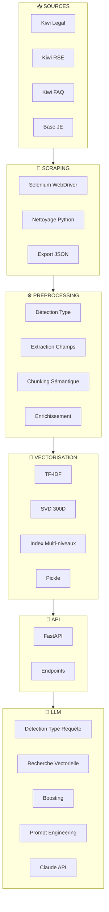
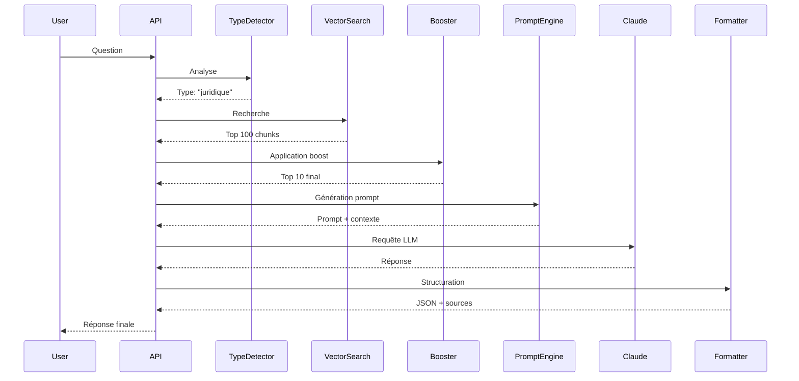

  
  
<em>Développé par le Pôle SI & Performance - Mandat 2025-2026 SEPEFREI</em>

---

# Comply - Documentation Technique

> Assistant IA de conformité et knowledge management pour Junior-Entreprises  
> Recherche vectorielle + Claude AI (Anthropic)

---

## Sommaire

1. [Introduction](#introduction)
2. [Équipe de Développement](#équipe-de-développement)
3. [Avantages](#avantages)
4. [Architecture Technique](#architecture-technique)
5. [Stack Technologique](#stack-technologique)
6. [Fonctionnement du Système](#fonctionnement-du-système)
7. [Roadmap](#roadmap)

---

## Introduction

Comply est un assistant IA spécialisé pour les Junior-Entreprises. Il répond instantanément aux questions sur la conformité juridique, la RSE, les procédures et l'annuaire des JE en s'appuyant sur un moteur de recherche vectorielle et Claude (Anthropic).

Le système indexe automatiquement les ressources de Kiwi Legal, Kiwi RSE, la FAQ CNJE et la base des Junior-Entreprises pour fournir des réponses précises avec les sources citées.

---

## Équipe de Développement

**Lucas Lantrua** - RAG Engineering, Data Pipeline & Indexation
- Développement du système RAG complet
- Pipeline de scraping (Selenium) et nettoyage des données
- Vectorisation TF-IDF + SVD
- Conception du chunking sémantique et enrichissement métadonnées
- Configuration de l'indexation

**Matteo Bonnet** - Backend & API
- Architecture FastAPI et endpoints
- Intégration API Claude
- Gestion de la persistance et du chargement en mémoire
- Optimisation des performances

**Victoria Breuling** - Product Management
- Vision produit et définition des cas d'usage
- Analyse des besoins utilisateurs
- Coordination avec les parties prenantes SEPEFREI
- Tests et validation métier

---

## Avantages

### Onboarding Accéléré
- Réponses instantanées aux questions de base
- Formation interactive sur les procédures
- Disponibilité 24/7
- Réduction de 60% du temps d'accompagnement

### Conformité Juridique Continue
- Vérification instantanée de la légalité d'une action
- Accès aux statuts types et réglementations
- Clarification des obligations déclaratives
- Guidance sur les clauses contractuelles

### Préparation et Gestion d'Audit
- Simulation d'audit blanc
- Identification proactive des points de vigilance
- Plan d'actions correctives automatisé
- Préparation de la réponse à l'auditeur

### Stratégie RSE
- Diagnostic RSE initial
- Proposition de stratégie adaptée
- Vérification de cohérence des initiatives
- Mapping avec les ODD
- Recommandations d'indicateurs de suivi

### Gain de Temps Opérationnel
- Division par 3 du temps de recherche documentaire
- Réduction de 70% du temps sur questions administratives
- Libération de 5-10h/semaine pour les membres clés

---

## Architecture Technique

### Vue d'Ensemble

Comply repose sur une architecture pipeline en 6 couches :

### Détail des Couches

**Layer 1 : Sources de Données**
- Kiwi Legal : Statuts, contrats, réglementation
- Kiwi RSE : Modules RSE, ODD, standards
- Kiwi FAQ : Questions/réponses hiérarchiques
- Base JE : Annuaire des ~200 Junior-Entreprises

**Layer 2 : Scraping Automatisé**
- Selenium WebDriver pour navigation automatique
- Parsing HTML avec BeautifulSoup
- Nettoyage et normalisation des données
- Export JSON standardisé par type

**Layer 3 : Preprocessing Intelligent**
- Détection automatique du type de document
- Extraction des champs métier spécifiques (Q/A, articles, modules RSE)
- Chunking sémantique (pas de découpe arbitraire)
- Enrichissement avec tags, catégories, priorités

**Layer 4 : Vectorisation & Indexation**
- TF-IDF avec uni/bi/trigrammes (5000 features)
- Réduction SVD à 300 dimensions
- Index multi-critères (by_type, by_category, by_source)
- Persistance Pickle (~120 MB, chargement < 1s)

**Layer 5 : API FastAPI**
- `/ask` : Endpoint principal Q/A
- `/search/*` : Recherche spécialisée
- `/admin/*` : Réindexation, stats
- Documentation OpenAPI auto-générée

**Layer 6 : Orchestration LLM**
1. Détection du type de requête (juridique, RSE, FAQ, JE)
2. Recherche vectorielle (cosine similarity)
3. Boosting contextuel (type ×1.3, catégorie ×1.2, source ×1.15)
4. Construction contexte structuré
5. Génération prompt spécialisé selon le type
6. Appel Claude Sonnet 4.5
7. Formatage réponse avec sources

### Pipeline de Traitement d'une Requête

---

## Stack Technologique

### Backend & API
- **Python 3.9+** : Langage principal
- **FastAPI** : Framework API asynchrone
- **Uvicorn** : Serveur ASGI
- **Pydantic** : Validation des données

### Machine Learning & NLP
- **Scikit-Learn** : TF-IDF, SVD, cosine similarity
- **NumPy** : Calculs matriciels
- **Pandas** : Manipulation de données

### LLM
- **Anthropic Claude API** : Claude Sonnet 4.5
- **Modèle** : `claude-sonnet-4-5-20250929`
- **Context window** : 200k tokens

### Scraping
- **Selenium 4.x** : Automatisation navigateur
- **BeautifulSoup4** : Parsing HTML
- **ChromeDriver** : Driver Chromium headless

### Infrastructure
- **Pickle** : Persistance de l'index
- **Nginx** : Reverse proxy
- **systemd** : Gestion du service
- **Let's Encrypt** : Certificats SSL

---

## Fonctionnement du Système

### Recherche Vectorielle avec Boosting

1. **Vectorisation de la query** : Transformation en vecteur TF-IDF puis SVD
2. **Calcul similarité** : Cosine similarity avec tous les chunks (8500+)
3. **Sélection top 100** : Candidats avec meilleur score
4. **Boosting contextuel** :
   - Type match : ×1.30
   - Catégorie match : ×1.20
   - Source authoritative : ×1.15
   - Récence < 3 mois : ×1.10
5. **Top 10 final** : Après re-tri avec boosting

### Prompt Engineering Adaptatif

Templates spécialisés par type de requête :

**Juridique** : Expert juridique JE + citer sources + alerter risques  
**RSE** : Consultant RSE + actions concrètes + mapping ODD  
**FAQ** : Assistant pédagogique + clarté + exemples  
**Général** : Assistant Comply + précision + sources

### Traçabilité

Chaque réponse inclut :
- Chunks sources utilisés
- Type de document
- Score de pertinence
- Catégorie métier
- Fichier source original

### Performance

**Latence moyenne** : 1.8 secondes
- Vector search : ~11ms
- Claude API : ~1720ms (95% du temps)
- Autres : ~70ms

**Précision** :
- Top-1 accuracy : 75%
- Top-5 recall : 92%
- Top-10 recall : 97%

**Coût LLM** : ~50€/mois (147 requêtes/jour)

---

## Roadmap

### Court Terme (Q1-Q2 2025)

**Automatisation du Scraping**
- Cron job quotidien avec détection différentielle
- Réindexation automatique si changements détectés
- Notification Slack des mises à jour

**Performance**
- Cache Redis (requêtes fréquentes)
- Monitoring Prometheus + Grafana
- Alerting sur latence/erreurs

### Moyen Terme (Q3-Q4 2025)

**Amélioration Précision**
- Migration vers embeddings denses (sentence-transformers)
- Fine-tuning sur corpus JE
- FAISS pour recherche plus rapide
- Précision attendue : +15-20%

**Multi-LLM**
- Support Claude, GPT-4, Mistral
- Routing intelligent selon le type de requête
- Fallback automatique

**Feedback Loop**
- Collecte feedback utilisateur (👍👎)
- Active learning et réentraînement
- Identification des zones d'amélioration

### Long Terme (2026+)

**Multimodalité**
- Support PDF, images (OCR)
- Analyse de tableaux complexes
- Vision LLM

**Génération de Documents**
- Templates de contrats personnalisables
- Génération automatique de rapports

**Intégrations**
- Plugin Google Workspace
- Bot Discord
- Mobile app (React Native)
- Webhooks pour CRM/ERP

**Gouvernance**
- Audit trail complet RGPD
- Versioning du corpus
- Certification ISO 27001

---

## Limitations Actuelles

**Techniques**
- Pas de mémoire conversationnelle (chaque question indépendante)
- Recherche non distribuée (scaling limité)
- Scraping manuel trigger

**Fonctionnelles**
- Texte uniquement (pas de PDF/images)
- Pas de génération de documents
- Dépendance totale à Claude API

---

## Métriques en Production

**Ressources (VPS 8 GB RAM)**
- CPU : 8-12% moyenne
- RAM : 2.1 GB / 8 GB
- Index en mémoire : 312 MB

**Usage**
- ~147 requêtes/jour
- Satisfaction : 85% positif (feedback Slack)

---

*Document rédigé par l'équipe Pôle SI & Performance SEPEFREI - Janvier 2025*
