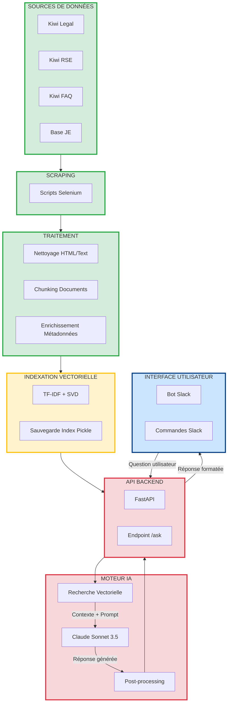
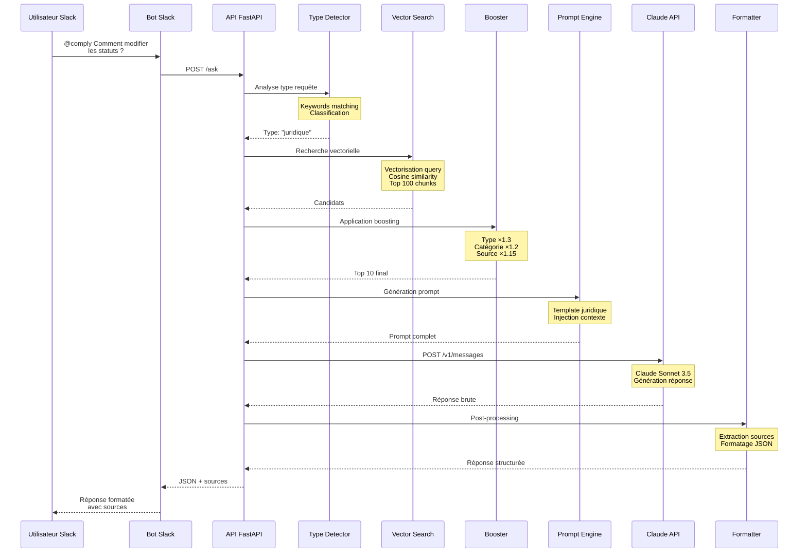

<h1>Comply - Your JE Compliance Assistant</h1>

<div style="text-align: center;">
  
  <p><em>Développé par le Pôle SI & Performance - Mandat 2025-2026 Sepefrei</em></p>

  <h1>Documentation Technique</h1>

  <p><strong>Assistant IA de conformité et knowledge management pour Junior-Entreprises</strong></p>
</div>

---

## Sommaire

1. [Introduction](#introduction)
2. [Équipe de Développement](#équipe-de-développement)
3. [Avantages et Cas d'Usage](#avantages-et-cas-dusage)
4. [Architecture Technique](#architecture-technique)
5. [Stack Technologique](#stack-technologique)
6. [Fonctionnement du Système](#fonctionnement-du-système)
7. [Accès et Utilisation](#accès-et-utilisation)
8. [Infrastructure Recommandée](#infrastructure-recommandée)
9. [Roadmap](#roadmap)
10. [Installation et déploiement](#installation)

---

## Introduction

**Comply** est un assistant IA spécialisé conçu pour accompagner les Junior-Entreprises dans leur conformité juridique, leur gestion RSE et leurs opérations quotidiennes. Le système combine un moteur de recherche vectorielle avancé avec le modèle de langage Claude d'Anthropic pour fournir des réponses contextuelles et précises.

L'outil indexe automatiquement l'ensemble des ressources de l'écosystème Junior-Entreprise : documentation juridique de Kiwi Legal, modules RSE de Kiwi RSE, FAQ CNJE multi-niveaux, et l'annuaire complet des Junior-Entreprises françaises.

La valeur ajoutée de Comply réside dans sa capacité à comprendre le contexte métier des questions posées et à adapter ses réponses en conséquence. Le système cite systématiquement ses sources, identifie les risques juridiques potentiels, et propose des actions concrètes adaptées à la réalité des Junior-Entreprises.

---

Comply a été développé par le **Pôle Système d'Information & Performance de SEPEFREI** durant le mandat 2025-2026.

### [Lucas Lantrua](https://github.com/zeus-black) - RAG Engineering, Data Pipeline & Indexation

Lucas a conçu et développé l'ensemble du système RAG (Retrieval-Augmented Generation) qui constitue le cœur de Comply. Ses contributions incluent :

- **Pipeline de scraping et acquisition des données** : Développement des scripts Selenium pour extraire automatiquement le contenu des sources Kiwi (scripts non publics).
- **Nettoyage et structuration des données** : Création de parsers spécialisés par type de document pour transformer les données brutes en JSON structuré exploitable.
- **Système de vectorisation** : Configuration et optimisation du pipeline TF-IDF + SVD pour la vectorisation des documents.
- **Chunking sémantique** : Conception d'un système de découpe intelligent qui préserve la cohérence sémantique.
- **Construction de l'index** : Implémentation des index multi-niveaux et du système de persistance.

### [Matteo Bonnet](https://github.com/0zzone) - Backend & API Development

Matteo a développé l'ensemble de la couche API et de l'orchestration. Ses contributions incluent :

- **Architecture FastAPI** : Design de l'architecture modulaire et implémentation des endpoints.
- **Intégration Claude** : Développement du client API Anthropic avec gestion des erreurs et rate limiting.
- **Système de recherche** : Implémentation du moteur de recherche vectorielle avec boosting contextuel.
- **Bot Slack** : Développement du bot Slack permettant d'interagir avec Comply.
- **Optimisation des performances** : Profiling et optimisation de la latence.

### [Victoria Breuling](https://github.com/Victoriabrl) - Product Management & Strategic Vision

Victoria a défini la vision produit et piloté les aspects stratégiques et organisationnels du projet. Ses contributions incluent :

- **Analyse des besoins** : Interviews des membres pour identifier les cas d'usage prioritaires.
- **Définition de la vision produit** : Cadrage du scope fonctionnel et priorisation des fonctionnalités.
- **Coordination parties prenantes** : Liaison avec les équipes CNJE pour accès aux ressources documentaires.
- **Tests et validation métier** : Coordination des beta-tests et validation de la pertinence des réponses.

---

## Avantages et Cas d'Usage

### Accélération de l'Onboarding

L'intégration d'un nouveau membre nécessite traditionnellement plusieurs semaines d'accompagnement pour maîtriser les statuts, les procédures métier, et les obligations légales.

**Comply transforme ce processus** en offrant un accès instantané à toute la documentation via conversation naturelle. Les nouveaux membres peuvent poser leurs questions au fil de l'eau sans mobiliser les anciens.

### Conformité Juridique Continue

Les Junior-Entreprises évoluent dans un cadre juridique complexe. La méconnaissance de ces règles peut entraîner des sanctions financières ou des problèmes lors des audits.

**Comply agit comme un juriste de poche** en vérifiant instantanément la légalité d'une action envisagée, en clarifiant les obligations déclaratives, et en alertant sur les risques potentiels. Le système cite systématiquement les sources applicables.

### Préparation et Gestion d'Audit

Les audits CNJE sont des moments critiques. Une préparation insuffisante peut compromettre la labellisation.

**Comply facilite la préparation** en permettant d'interroger rapidement la documentation officielle et d'identifier les points de vigilance avant l'audit.

### Stratégie RSE et Développement Durable

La RSE devient un critère différenciant pour les Junior-Entreprises, mais structurer une démarche cohérente requiert une expertise souvent absente.

**Comply facilite l'implémentation RSE** en proposant des recommandations basées sur les modules RSE officiels avec mapping ODD.

### Gain de Temps Opérationnel

Au-delà des cas d'usage spécifiques, Comply génère un gain de productivité quotidien sur l'ensemble des opérations en réduisant drastiquement le temps de recherche documentaire.

---

## Architecture Technique

### Vue d'Ensemble du Système

Comply repose sur une architecture pipeline en 6 couches qui transforme des données brutes en réponses intelligentes accessibles via Slack.



### Détail des Couches

**Layer 1 : Sources de Données**

Les données proviennent de quatre sources principales de l'écosystème Junior-Entreprise :
- **Kiwi Legal** : Documentation juridique complète (statuts types, modèles de contrats, règlements, obligations déclaratives)
- **Kiwi RSE** : Modules RSE structurés par pilier avec mapping des Objectifs de Développement Durable (ODD)
- **Kiwi FAQ** : Base de questions/réponses hiérarchisée en 3 niveaux couvrant toutes les thématiques JE
- **Base Junior-Entreprises** : Annuaire complet des ~200 Junior-Entreprises françaises avec coordonnées et domaines d'expertise

**Layer 2 : Acquisition Automatisée (Scraping)**

Le scraping s'effectue via **Selenium** qui automatise un navigateur pour extraire le contenu dynamique des plateformes Kiwi. Les scripts gèrent la navigation JavaScript, la pagination, et l'attente du rendu complet avant extraction. Le HTML brut est ensuite nettoyé (suppression des éléments non pertinents) et normalisé (encodage UTF-8). Les données sont exportées dans un format JSON standardisé.

*Note : Les scripts de scraping ne sont pas encore publics.*

**Layer 3 : Preprocessing Intelligent**

Cette couche transforme les données brutes en unités sémantiques optimisées :
- **Détection automatique du type** : Classification de chaque document (Legal, RSE, FAQ, JE) via analyse du nom, de la structure JSON, et du contenu
- **Extraction spécialisée** : Parsers dédiés qui extraient les champs pertinents selon le type (questions/réponses pour FAQ, articles pour Legal, actions pour RSE, coordonnées pour JE)
- **Chunking sémantique** : Découpe intelligente qui respecte la logique métier (une paire Q/A = un chunk, un article de statuts = un chunk, etc.) plutôt qu'une simple division par longueur
- **Enrichissement** : Ajout automatique de tags, catégories, priorités, et contexte parent pour faciliter la recherche

**Layer 4 : Vectorisation & Indexation**

La vectorisation transforme le texte en vecteurs numériques comparables mathématiquement :
- **TF-IDF** : Technique de vectorisation qui donne plus de poids aux termes rares et discriminants. Configuration avec uni/bi/trigrammes, 5000 features maximum, et stopwords personnalisés Junior-Entreprise
- **Truncated SVD** : Réduction dimensionnelle de 5000 à 300 dimensions pour accélérer les recherches tout en préservant l'essentiel de la sémantique
- **Index multi-niveaux** : Construction d'index secondaires par type, catégorie et source pour permettre le filtrage et le boosting
- **Persistance Pickle** : L'index complet (~120 MB) est sauvegardé dans un fichier unique chargé en mémoire au démarrage en moins d'une seconde

**Layer 5 : API FastAPI**

FastAPI expose l'intelligence du système via une API REST performante et documentée :
- Architecture modulaire (routers, services, models) pour une maintenance aisée
- Endpoints principaux : `/ask` (Q/A), `/search` (recherche avancée), `/admin` (gestion)
- Validation automatique des inputs/outputs via Pydantic
- Documentation OpenAPI auto-générée pour faciliter les intégrations

**Layer 6 : Orchestration LLM**

Cette couche orchestre le pipeline complet de traitement :
1. **Détection du type de requête** : Classification automatique (juridique, RSE, FAQ, JE, général) pour adapter le traitement
2. **Recherche vectorielle** : Calcul de similarité entre la question et tous les chunks indexés
3. **Boosting contextuel** : Application de coefficients multiplicateurs selon le type (×1.3), la catégorie (×1.2), la source (×1.15), et la récence (×1.1)
4. **Sélection des meilleurs chunks** : Extraction des 10 chunks les plus pertinents après boosting
5. **Construction du contexte** : Agrégation des chunks avec leurs métadonnées dans un format structuré
6. **Prompt engineering** : Génération d'un prompt spécialisé selon le type détecté avec injection du contexte
7. **Appel Claude** : Requête à l'API Anthropic (Claude Sonnet 3.5) pour générer la réponse
8. **Formatage** : Structuration de la réponse avec extraction des sources citées et génération de questions liées

**Layer 7 : Bot Slack**

Le bot Slack rend Comply accessible directement dans l'outil de communication quotidien des Junior-Entreprises. Les utilisateurs peuvent mentionner `@comply` dans n'importe quel canal ou envoyer un message privé au bot. Les réponses sont formatées de manière claire avec les sources et des liens vers la documentation complète.

### Pipeline de Traitement d'une Requête



---

## Stack Technologique

### Backend & API

**Python 3.9+** : Langage principal pour l'écosystème ML/NLP mature et la productivité de développement.

**FastAPI** : Framework web pour sa performance asynchrone et sa validation automatique des données via Pydantic.

**Uvicorn** : Serveur ASGI haute performance.

### Machine Learning & NLP

**Scikit-Learn** : Vectorisation TF-IDF, réduction SVD, calcul de similarité.

**NumPy** : Calculs matriciels et manipulation de vecteurs.

### LLM & IA

**Anthropic Claude API** : Claude Sonnet 3.5 pour sa qualité de réponse, son adhérence aux instructions, et son faible taux d'hallucinations.

### Scraping & Data

**Selenium 4.x** : Automatisation de navigateur pour scraper les sites dynamiques (scripts non publics).

**BeautifulSoup4** : Parsing HTML et extraction de données.

### Infrastructure

**Pickle** : Persistance de l'index complet.

**Nginx** : Reverse proxy pour SSL et rate limiting.

**systemd** : Gestion du service en production.

---

## Fonctionnement du Système

### Recherche Vectorielle avec Boosting Contextuel

1. **Vectorisation de la query** : Transformation en vecteur TF-IDF puis réduction SVD à 300 dimensions.

2. **Calcul de similarité** : Similarité cosinus avec tous les chunks indexés (~8500+).

3. **Boosting contextuel** : Application de coefficients multiplicateurs selon le type de document, la catégorie, la source, et la récence.

4. **Sélection finale** : Extraction des 10 meilleurs chunks pour construction du contexte.

### Prompt Engineering Adaptatif

Comply génère des prompts spécialisés selon le type de requête détecté (juridique, RSE, FAQ, général). Chaque template est optimisé pour son domaine avec des instructions spécifiques et l'injection du contexte pertinent.

### Traçabilité

Chaque réponse inclut :
- Les chunks sources utilisés
- Le type et la catégorie de chaque source
- Le score de pertinence
- Le fichier source original

### Performance

**Latence moyenne** : ~1.8 secondes
- Recherche vectorielle : ~15ms
- Appel Claude : ~1.7s (95% du temps)
- Autres traitements : ~85ms

**Précision** :
- Top-5 recall : ~92%

---

## Accès et Utilisation

### Bot Slack

Comply est accessible via un bot Slack qui permet une interaction naturelle :

**Utilisation par mention** :
```
@comply Comment modifier les statuts d'une JE ?
```

**Utilisation par message direct** :
```
Envoyer un message privé au bot Comply
```

Le bot répond avec :
- La réponse générée par Claude
- Les sources utilisées
- Des liens vers la documentation complète si nécessaire

### API REST

Pour des intégrations avancées, Comply expose également une API REST FastAPI
---

## Infrastructure Recommandée

### Choix du Serveur VPS

Pour héberger Comply en production, un VPS Debian offre le meilleur compromis.

#### Spécifications Recommandées

| Composant | Minimum | Recommandé |
|-----------|---------|------------|
| **CPU** | 2 vCores | 4 vCores |
| **RAM** | 4 GB | 8 GB |
| **Stockage** | 20 GB SSD | 40 GB SSD |
| **Bande passante** | 100 Mbps | 200 Mbps |

#### Fournisseurs VPS Recommandés (France)

**1. Contabo - Cloud VPS 10** ⭐ (Notre recommandation)
- **Prix** : 5,36€/mois
- **Configuration** : 3 vCores, 8 GB RAM, 150 GB SSD
- **Avantages** : Excellent rapport qualité/prix, ressources généreuses
- **Lien** : [https://contabo.com/en/vps/cloud-vps-10/](https://contabo.com/en/vps/cloud-vps-10/)

**2. Hetzner - CX32**
- **Prix** : 6,80€/mois
- **Configuration** : 4 vCores, 8 GB RAM, 80 GB SSD
- **Avantages** : Infrastructure fiable, excellente connectivité
- **Lien** : [https://www.hetzner.com/cloud](https://www.hetzner.com/cloud)

**3. OVH - VPS Comfort**
- **Prix** : 4,58€/mois
- **Configuration** : 4 vCores, 8 GB RAM, 75 GB SSD
- **Avantages** : Hébergeur français, support local
- **Lien** : [https://www.ovhcloud.com/fr/vps/](https://www.ovhcloud.com/fr/vps/)

#### Notre Recommandation : Contabo VPS S SSD

**Contabo VPS S SSD** offre le meilleur compromis pour une Junior-Entreprise :
- Ressources largement suffisantes (8 GB RAM, 3 vCores)
- Coût accessible (~65€/an)
- Espace disque généreux (150 GB)
- Peut gérer 200-300 requêtes/jour confortablement

### Consommation de Ressources

**RAM** : ~2 GB utilisés / 8 GB
- Index en mémoire : ~300 MB
- Application : ~500 MB
- OS : ~1.2 GB

**CPU** : 8-12% en moyenne

**Disque** : ~9 GB utilisés

**Coût LLM** : ~50€/mois pour un usage modéré

---

## Roadmap

### Court Terme (Q1-Q2 2025)

**Automatisation du Scraping**
- Cron job quotidien avec détection différentielle
- Réindexation automatique si changements détectés
- Notification Slack des mises à jour

**Monitoring**
- Métriques Prometheus
- Dashboard Grafana
- Alerting sur latence/erreurs

**Cache**
- Redis pour requêtes fréquentes
- Réduction des coûts LLM de 20-30%

### Moyen Terme (Q3-Q4 2025)

**Amélioration Précision**
- Migration vers embeddings denses (sentence-transformers)
- Amélioration de la précision de 15-20%

**Multi-LLM**
- Support Claude, GPT-4, Mistral
- Routing intelligent selon le type de requête
- Fallback automatique

**Feedback Loop**
- Collecte feedback utilisateur
- Amélioration continue basée sur les retours

### Long Terme (2026+)

**Multimodalité**
- Support PDF, images (OCR)
- Analyse de tableaux complexes
- Analyse Kiwi et Kiwi Formation

**Génération de Documents**
- Templates de contrats personnalisables
- Génération automatique de rapports

**Intégrations**
- Plugin Google Docs
- Bot Discord
- Mobile app

---

## Limitations Actuelles

**Techniques**
- Pas de mémoire conversationnelle (chaque question indépendante)
- Recherche non distribuée
- Scraping manuel trigger

**Fonctionnelles**
- Texte uniquement (pas de PDF/images pour l'instant)
- Pas de génération de documents
- Dépendance à l'API Claude

---

## Choix Techniques

### TF-IDF + SVD

Comply utilise TF-IDF plutôt que des embeddings transformers pour la performance (< 2ms vectorisation, ~15ms recherche) et l'empreinte mémoire réduite (~300 MB). Pour un corpus métier avec vocabulaire technique stable, TF-IDF est suffisant et permet de fonctionner sur un VPS entrée de gamme.

### Pickle

L'index est sérialisé dans un fichier Pickle unique pour la simplicité (pas de service externe, chargement < 1s, pas de latence réseau). Suffisant pour le scale actuel (~8500 chunks).

### FastAPI

Choisi pour sa performance asynchrone (gestion de 10-20 requêtes simultanées sans bloquer pendant les appels LLM de 1-3s) et sa validation automatique via Pydantic.

### Claude Sonnet 3.5

Sélectionné pour son adhérence exceptionnelle aux instructions, son faible taux d'hallucinations (critique en contexte juridique), et son coût maîtrisé.

---

## Installation et déploiement

### Installation locale

#### Prérequis
- Python 3.11
- Node.js et pnpm
- Variables d'environnement configurées

#### Étape 1 : Créer l'environnement Python

```bash
# Créer l'environnement virtuel
python3.11 -m venv .venv

# Activer l'environnement (Mac/Linux)
source .venv/bin/activate

# Activer l'environnement (Windows)
.venv\Scripts\activate
```

#### Étape 2 : Installer les dépendances Python

```bash
cd api/
pip install -r requirements.txt
```

#### Étape 3 : Configurer les variables d'environnement

Créez un fichier `.env` dans le dossier `api/` en vous basant sur `.env.example` :

```bash
cp .env.example .env
```

Renseignez les variables obligatoires :
- `CLAUDE_API_KEY` : Votre clé API Claude
- `DATA_DIR` : Dossier contenant les données sources
- `VECTOR_DB_PATH` : Chemin vers le fichier d'index vectoriel (.pkl)
- `SLACK_BOT_TOKEN` : Token du bot Slack
- `SLACK_SIGNING_SECRET` : Secret de signature Slack
- `SLACK_APP_TOKEN` : Token d'application Slack (pour Socket Mode)
- `API_URL` : URL de l'API (ex: http://localhost:8000)

#### Étape 4 : Lancer l'API

```bash
cd api/
python main_kiwi_advanced.py
```

L'API sera accessible sur `http://localhost:8000`

#### Étape 5 : Installer et lancer le bot Slack

Dans un nouveau terminal :

```bash
cd slack-bot/
pnpm install
```

Créez également un fichier `.env` dans le dossier `slack-bot/` :

```bash
cp .env.example .env
```

Puis lancez le bot :

```bash
pnpm dev
```

---

### Installation Docker

Pour un déploiement simplifié, utilisez Docker Compose.

#### Prérequis
- Docker et Docker Compose installés
- Variables d'environnement configurées dans les fichiers `.env`

#### Étape 1 : Configuration

Assurez-vous que les fichiers `.env` sont présents dans :
- `api/.env`
- `slack-bot/.env`

#### Étape 2 : Lancement

À la racine du projet :

```bash
docker compose up -d --build
```

Cette commande va :
- Construire les images Docker
- Lancer l'API FastAPI
- Lancer le bot Slack
- Configurer le réseau entre les services

#### Étape 3 : Vérification

```bash
# Voir les logs
docker compose logs -f

# Vérifier que les services tournent
docker compose ps
```

#### Arrêt des services

```bash
docker compose down
```

---

### Configuration

#### Variables d'environnement requises

**api/.env**
```env
CLAUDE_API_KEY=sk-ant-xxxxx
DATA_DIR=./data
VECTOR_DB_PATH=./kiwi_index.pkl
```

**slack-bot/.env**
```env
SLACK_BOT_TOKEN=xoxb-xxxxx
SLACK_SIGNING_SECRET=xxxxx
SLACK_APP_TOKEN=xapp-xxxxx
API_URL=http://localhost:8000
```

---

## Dépannage

### Problème : L'API ne trouve pas le fichier pickle

**Symptôme** : Erreur `FileNotFoundError: kiwi_index.pkl`

**Solution** : 
- Vérifiez que le chemin `VECTOR_DB_PATH` dans `api/.env` pointe vers le bon fichier
- Le fichier `kiwi_index.pkl` doit être dans le dossier `api/`
- Si absent, exécutez le script de génération de l'index :
  ```bash
  cd api/
  python generate_index.py
  ```

### Problème : Le bot Slack ne répond pas

**Vérifications** :
1. L'API est bien lancée et accessible
2. Le `SLACK_BOT_TOKEN` est valide
3. Le bot a les permissions OAuth nécessaires dans Slack
4. L'URL de l'API est correcte dans `slack-bot/.env`

### Problème : Erreur Docker "port already in use"

**Solution** :
```bash
# Identifier le processus utilisant le port
lsof -i :8000  # Mac/Linux
netstat -ano | findstr :8000  # Windows

# Arrêter le processus ou changer le port dans compose.yml
```

### Problème : Réponses lentes ou timeouts

**Causes possibles** :
- Index trop volumineux (> 100 000 chunks)
- Pas assez de mémoire RAM
- Clé API Claude avec rate limit dépassé

**Solutions** :
- Réduire le nombre de chunks indexés
- Augmenter les ressources Docker
- Vérifier les quotas de votre clé API

### Logs et debugging

```bash
# Logs API en local
cd api/
python main_kiwi_advanced.py --debug

# Logs Docker
docker compose logs api -f
docker compose logs slack-bot -f

# Logs bot Slack en local
cd slack-bot/
pnpm dev  # Les logs s'affichent dans le terminal
```
---
## Contacts et Support

### Équipe Technique SEPEFREI

**Lucas Lantrua** - RAG Engineering & Data Pipeline  
Email : lucas.lantrua@sepefrei.fr

**Matteo Bonnet** - Backend & API Development  
Email : matteo.bonnet@sepefrei.fr

**Victoria Breuling** - Product Management  
Email : victoria.breuling@sepefrei.fr

### Support

**Pour les Junior-Entreprises utilisatrices** :
- Slack : Lucas Lantrua sur le canal Slack CNJE
- Email : rsi@sepefrei.fr

---

## Licence

**Comply** est un projet open-source sous licence MIT.

Développé par **SEPEFREI - Junior entreprise de l'école d'ingénieur EFREI**.

Voir le fichier [LICENSE](LICENSE) pour plus de détails.

© 2025 SEPEFREI

---

*Document rédigé par l'équipe Pôle SI & Performance SEPEFREI*  
*Mandat 2025-2026 - Version 1.1
